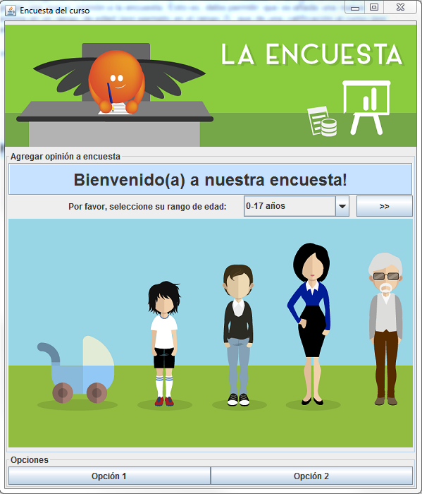

Enunciado
=========

Se quiere crear una aplicación que permita realizar encuesta de opinión de un curso y manejar
sus resultados. La encuesta consiste en una única pregunta, en la cual se le pide a la persona
dar su opinión acerca del curso, dando un valor entre 0 y 10.
Se desea poder conocer los resultados de la en cuenta para diferentes sectores demográficos.
Para esto se tendrá en cuenta el rango el rango de edad y el estado civil (soltero o casado) de
la persona.
En la encuesta se dividieron las personas en tres rangos de edad:

* Menores de 18,
* Entre 18 y 54 y
* Con 55 o más años.

El programa debe permitir:

1. Visualizar el promedio total de la encuesta.
2. Visualizar el número total de opiniones recogidas con la encuesta.
3. Agregar una opinión a la encuesta especificando rango de edad y estado civil.
4. Consultar el valor parcial de la encuesta para un sector demográfico (rango de edad y
estado civil).

Interfaz
========

